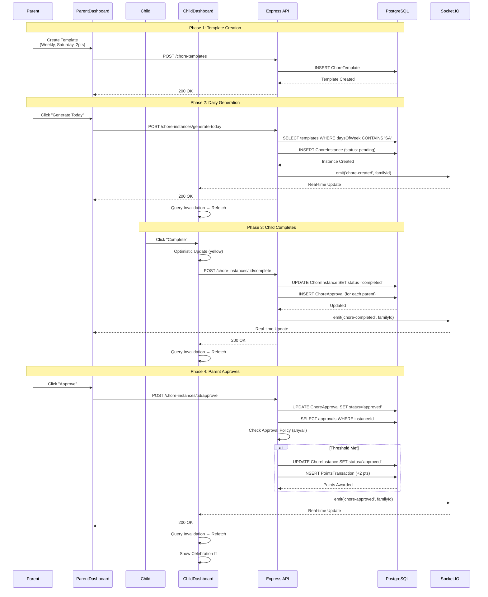
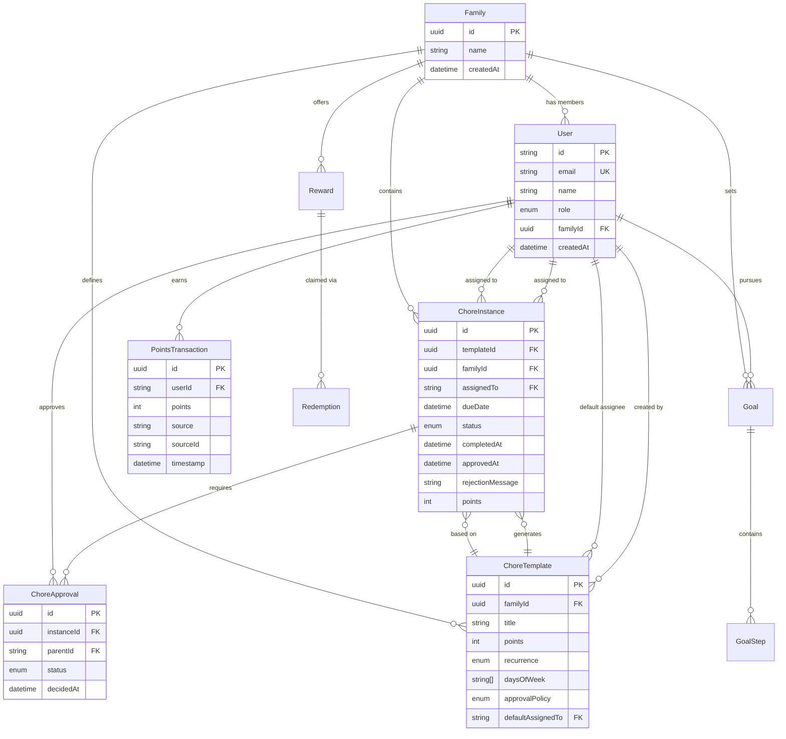

# Mestring - System Architecture Documentation

> **Last Updated:** January 26, 2026  
> **Version:** 1.0  
> **Tech Stack:** React 18 + TypeScript, Node.js + Express, PostgreSQL (Supabase), Prisma ORM

---

## Table of Contents

1. [System Overview](#system-overview)
2. [Component Architecture Diagram](#component-architecture-diagram)
3. [Data Flow - Chore Lifecycle](#data-flow---chore-lifecycle)
4. [Database Schema (ER Diagram)](#database-schema-er-diagram)
5. [Component Hierarchy](#component-hierarchy)
6. [Key Architectural Patterns](#key-architectural-patterns)

---

## System Overview

Mestring is a full-stack family chore management application with gamification elements. The architecture follows a modern **three-tier pattern**:

- **Frontend:** React SPA with TypeScript, deployed on Vite dev server (production: Vercel)
- **Backend:** Node.js REST API with Socket.IO for real-time updates (production: Render)
- **Database:** PostgreSQL managed by Supabase, accessed via Prisma ORM

**Core Concepts:**

- **ChoreTemplate** = Reusable chore definition with recurrence rules
- **ChoreInstance** = Actual task generated from template for specific date/assignee
- **ChoreApproval** = Parent sign-off on completed chores
- **PointsTransaction** = Immutable ledger for points awarded/redeemed

---

## Component Architecture Diagram

```mermaid
graph TB
    subgraph "Frontend - React App (Port 5173)"
        App["App.tsx\nTab Navigation"]
        Auth["AuthGate.tsx\nUser Switcher"]

        subgraph "Feature Modules"
            Dashboard[Dashboard]
            Chores[Chores]
            Calendar[Calendar]
            Points[Points]
            Goals[Goals]
            Testing[Testing]
        end

        subgraph "Dashboard Components"
            ChildDash["ChildDashboard.tsx\nToday's Tasks\nWeekly Points\nRecent Activity"]
            ParentDash["ParentDashboard.tsx\nPending Approvals\nFamily Leaderboard\nActivity Timeline"]
        end

        subgraph "Chores Components"
            Templates["ChoreTemplates.tsx\nCreate Templates\nAssign Chores"]
            Instances["ChoreInstances.tsx\nView All Chores\nComplete/Approve"]
        end

        subgraph "Other Components"
            Cal["ChoreCalendar.tsx\nMonth/Week/Day Views\nColor-coded Events"]
            PointsSum["PointsSummary.tsx\nTotal & Weekly Points\nLeaderboard"]
            GoalComp["Goals.tsx\nGoal Management"]
            UserSwitch["UserSwitcher.tsx\nDemo Mode Toggle"]
        end

        APIClient["api/client.ts\nAxios Instance\nTanStack Query"]
        SupaContext["SupabaseContext.tsx\nAuth State"]
        DemoConfig["config/demo.ts\nDemo Mode Config"]
    end

    subgraph "Backend - Express API (Port 3001)"
        Server["index.js\nExpress Server\nSocket.IO"]

        subgraph "API Routes"
            ChoreTemplateRoute["choreTemplates.js\nGET, POST templates"]
            ChoreInstanceRoute["choreInstances.js\nCRUD instances\nComplete/Approve/Reject"]
            PointsRoute["points.js\nSummary\nLeaderboard"]
            UsersRoute["users.js\nFamily Members"]
            GoalsRoute["goals.js"]
            ChoresRoute["chores.js\nLegacy"]
        end

        Middleware["auth.js\nJWT Verification\n(Disabled)"]
        PrismaClient["db.js\nPrisma Client"]
    end

    subgraph "Database - PostgreSQL (Supabase)"
        subgraph "Core Models"
            FamilyModel[(Family)]
            UserModel[(User)]
        end

        subgraph "Chore System"
            TemplateModel["(ChoreTemplate\nRecurrence Rules)"]
            InstanceModel["(ChoreInstance\nActual Tasks)"]
            ApprovalModel["(ChoreApproval\nParent Approvals)"]
        end

        subgraph "Gamification"
            PointsModel["(PointsTransaction\nImmutable Ledger)"]
            GoalModel["(Goal)"]
            StepModel["(GoalStep)"]
            RewardModel["(Reward)"]
            RedemptionModel["(Redemption)"]
        end
    end

    subgraph "External Services"
        Supabase["Supabase\nAuth + Database\nStorage"]
        SocketIO["Socket.IO\nReal-time Updates\nFamily Rooms"]
    end

    %% Frontend Connections
    App --> Dashboard
    App --> Chores
    App --> Calendar
    App --> Points
    App --> Goals
    App --> Testing
    App --> Auth

    Dashboard --> ChildDash
    Dashboard --> ParentDash

    Chores --> Templates
    Chores --> Instances

    Calendar --> Cal
    Points --> PointsSum
    Goals --> GoalComp
    Testing --> UserSwitch

    Auth --> SupaContext
    UserSwitch --> DemoConfig

    ChildDash --> APIClient
    ParentDash --> APIClient
    Templates --> APIClient
    Instances --> APIClient
    Cal --> APIClient
    PointsSum --> APIClient
    GoalComp --> APIClient

    APIClient --> Server
    SupaContext --> Supabase

    %% Backend Connections
    Server --> ChoreTemplateRoute
    Server --> ChoreInstanceRoute
    Server --> PointsRoute
    Server --> UsersRoute
    Server --> GoalsRoute
    Server --> ChoresRoute
    Server --> Middleware
    Server --> SocketIO

    ChoreTemplateRoute --> PrismaClient
    ChoreInstanceRoute --> PrismaClient
    PointsRoute --> PrismaClient
    UsersRoute --> PrismaClient
    GoalsRoute --> PrismaClient
    ChoresRoute --> PrismaClient

    %% Database Connections
    PrismaClient --> FamilyModel
    PrismaClient --> UserModel
    PrismaClient --> TemplateModel
    PrismaClient --> InstanceModel
    PrismaClient --> ApprovalModel
    PrismaClient --> PointsModel
    PrismaClient --> GoalModel
    PrismaClient --> StepModel
    PrismaClient --> RewardModel
    PrismaClient --> RedemptionModel

    %% External Connections
    Supabase -.->|PostgreSQL| PrismaClient
    SocketIO -.->|WebSocket| App

    classDef frontend fill:#e1f5ff,stroke:#0277bd,stroke-width:2px
    classDef backend fill:#fff3e0,stroke:#ef6c00,stroke-width:2px
    classDef database fill:#f3e5f5,stroke:#7b1fa2,stroke-width:2px
    classDef external fill:#e8f5e9,stroke:#388e3c,stroke-width:2px

    class App,Auth,Dashboard,Chores,Calendar,Points,Goals,Testing,ChildDash,ParentDash,Templates,Instances,Cal,PointsSum,GoalComp,UserSwitch,APIClient,SupaContext,DemoConfig frontend
    class Server,ChoreTemplateRoute,ChoreInstanceRoute,PointsRoute,UsersRoute,GoalsRoute,ChoresRoute,Middleware,PrismaClient backend
    class FamilyModel,UserModel,TemplateModel,InstanceModel,ApprovalModel,PointsModel,GoalModel,StepModel,RewardModel,RedemptionModel database
    class Supabase,SocketIO external
```



**Legend:**

- 🔵 Blue = Frontend (React Components)
- 🟠 Orange = Backend (API Routes)
- 🟣 Purple = Database (Prisma Models)
- 🟢 Green = External Services

---

## Data Flow - Chore Lifecycle

This sequence diagram shows the complete lifecycle of a chore from creation to approval:



**Key Points:**

1. **Optimistic Updates:** UI updates immediately, then confirms with server
2. **TanStack Query Invalidation:** Triggers automatic refetch after mutations
3. **Socket.IO Broadcasting:** Real-time updates across family members
4. **Approval Policy Logic:** Supports "any" (1 parent) or "all" (both parents) approval

---

## Database Schema (ER Diagram)

Entity-Relationship diagram showing all database models and their relationships:



**Cascade Deletes (Data Integrity):**

- Deleting a `Family` → cascades to all `ChoreTemplate`, `ChoreInstance`, `Goal`, `Reward`
- Deleting a `User` → cascades to all `ChoreInstance`, `ChoreApproval`, `PointsTransaction`
- Deleting a `ChoreTemplate` → cascades to all `ChoreInstance`
- Deleting a `ChoreInstance` → cascades to all `ChoreApproval`

---

## Component Hierarchy

Visual tree of all React components:

```
📱 App.tsx (Root)
│
├─ 🔐 AuthGate.tsx
│  ├─ SupabaseContext.tsx (Auth State Provider)
│  └─ UserSwitcher.tsx (Demo Mode Toggle)
│
├─ 🏠 Dashboard Tab
│  ├─ ChildDashboard.tsx
│  │  ├─ Today's Tasks List
│  │  ├─ Weekly Points Card (with progress bar to next reward)
│  │  ├─ Week-over-week comparison badge (↑↓)
│  │  ├─ Upcoming Chores Preview
│  │  └─ Recent Activity Feed (with celebration emojis 🎉)
│  │
│  └─ ParentDashboard.tsx
│     ├─ Pending Approvals Section (with red badge count)
│     ├─ "Approve All" Button (sequential processing)
│     ├─ Rejection Modal (with message textarea)
│     ├─ Family Leaderboard (with trend arrows ↑↓)
│     ├─ Quick Actions (Generate Today, Create Template)
│     └─ Activity Timeline (with undo approval link)
│
├─ 📋 Chores Tab
│  ├─ ChoreInstances.tsx
│  │  ├─ Status Filter (All, Pending, Completed, Approved)
│  │  ├─ Complete Button (Child)
│  │  ├─ Approve/Reject Buttons (Parent)
│  │  └─ Undo Button (Parent, for approved chores)
│  │
│  └─ ChoreTemplates.tsx (Parent Only)
│     ├─ Create Template Form
│     │  ├─ Title, Description, Points
│     │  ├─ Recurrence Type (once, daily, weekly, monthly)
│     │  ├─ Days of Week Checkboxes
│     │  ├─ Approval Policy (any, all)
│     │  └─ Default Assignee Dropdown
│     └─ Assignment Dropdown per Template
│
├─ 📅 Calendar Tab
│  └─ ChoreCalendar.tsx
│     ├─ View Selector (Month, Week, Day, Agenda)
│     ├─ Color-coded Events
│     │  ├─ Gray = Pending
│     │  ├─ Yellow = Completed
│     │  └─ Green = Approved
│     ├─ Weekly Points Summary Bar
│     ├─ Click-to-Complete (Child)
│     └─ Click-to-Approve (Parent)
│
├─ ⭐ Points Tab
│  └─ PointsSummary.tsx
│     ├─ Total Points Card (gradient background)
│     ├─ Weekly Points (This Week vs Last Week)
│     ├─ Family Leaderboard (sorted by weekly performance)
│     └─ Recent Transactions List
│
└─ 🎯 Goals Tab
   └─ Goals.tsx
      ├─ Goal List (Active, Draft, Completed)
      ├─ Goal Steps (ordered, with instructions)
      └─ Progress Tracking

🔧 Shared Utilities
├─ api/client.ts
│  ├─ Axios instance with base URL
│  ├─ Bearer token interceptor
│  └─ TanStack Query setup
│
├─ config/demo.ts
│  ├─ DEMO_MODE feature flag
│  ├─ DEMO_USERS array
│  ├─ getCurrentDemoUser()
│  ├─ setDemoUser()
│  └─ clearDemoUser()
│
└─ styles/index.css
   ├─ Tailwind base styles
   └─ react-big-calendar custom CSS
```

---

## Key Architectural Patterns

### 1. Feature-Based Organization

Components are organized by **feature domain**, not technical layer:

```
apps/web/src/features/
├── dashboard/     # Role-specific landing pages
├── chores/        # Chore management (templates + instances)
├── calendar/      # Calendar views
├── points/        # Points & leaderboard
├── goals/         # Goal tracking (future feature)
└── testing/       # Demo mode utilities
```

**Why:** Easier to locate related code, better encapsulation, scales to larger teams.

---

### 2. TanStack Query Pattern (Server State Management)

All API interactions follow this pattern:

```typescript
// Read data (GET)
const { data, isLoading, error } = useQuery({
  queryKey: ["chore-instances", familyId],
  queryFn: async () => {
    const response = await api.get("/chore-instances", {
      params: { familyId },
    });
    return response.data;
  },
  staleTime: 1000 * 60 * 5, // 5 minutes
});

// Write data (POST/PUT/DELETE)
const mutation = useMutation({
  mutationFn: async (choreId: string) => {
    return api.post(`/chore-instances/${choreId}/complete`);
  },
  onMutate: async () => {
    // Optimistic update (instant UI feedback)
    await queryClient.cancelQueries(["chore-instances"]);
    const previous = queryClient.getQueryData(["chore-instances"]);
    queryClient.setQueryData(["chore-instances"], (old) => {
      // Update local cache immediately
    });
    return { previous };
  },
  onError: (err, variables, context) => {
    // Rollback on error
    queryClient.setQueryData(["chore-instances"], context.previous);
  },
  onSuccess: () => {
    // Refetch to sync with server
    queryClient.invalidateQueries(["chore-instances"]);
    queryClient.invalidateQueries(["points-summary"]);
  },
});
```

**Benefits:**

- Automatic caching and deduplication
- Background refetching (stale-while-revalidate)
- Optimistic updates for instant UX
- Automatic retry on failure
- No manual state management needed

---

### 3. Real-Time Updates via Socket.IO

```typescript
// Backend: Broadcast to family room
import { emitFamily } from "../index.js";

router.post("/:id/complete", async (req, res) => {
  // ... update database ...

  emitFamily(io, instance.familyId, "chore-updated", {
    instanceId: instance.id,
    status: instance.status,
  });

  res.json(instance);
});

// Frontend: Listen and invalidate cache
useEffect(() => {
  const socket = io(VITE_SOCKET_URL);

  socket.emit("join-family", familyId);

  socket.on("chore-updated", () => {
    queryClient.invalidateQueries(["chore-instances"]);
  });

  return () => socket.disconnect();
}, [familyId]);
```

**Why:** Ensures all family members see updates instantly without manual refresh.

---

### 4. Role-Based UI Rendering

```typescript
// Read from localStorage (demo mode) or Supabase session
const userId = localStorage.getItem("demo-user-id") || session?.user.id;
const userRole = localStorage.getItem("demo-user-role") || session?.user.user_metadata?.role;

// Conditional rendering based on role
{tab === 'dashboard' && (
  userRole === 'parent'
    ? <ParentDashboard userId={userId} />
    : <ChildDashboard userId={userId} />
)}

// Component-level role checks
{userRole === 'parent' && (
  <button onClick={handleApprove}>Approve</button>
)}
```

**Why:** Same codebase serves different user experiences without separate apps.

---

### 5. Approval Policy Logic (Backend)

Supports flexible approval requirements:

```javascript
// ChoreTemplate has approvalPolicy: 'any' | 'all'

router.post("/:id/approve", async (req, res) => {
  const { id } = req.params;
  const { parentId } = req.body;

  // Update this parent's approval
  await prisma.choreApproval.update({
    where: { instanceId_parentId: { instanceId: id, parentId } },
    data: { status: "approved", decidedAt: new Date() },
  });

  // Get all approvals for this chore
  const approvals = await prisma.choreApproval.findMany({
    where: { instanceId: id },
  });

  const instance = await prisma.choreInstance.findUnique({
    where: { id },
    include: { template: true },
  });

  // Calculate if threshold met
  const approvedCount = approvals.filter((a) => a.status === "approved").length;
  const totalParents = approvals.length;

  let meetsThreshold = false;
  if (instance.template.approvalPolicy === "any") {
    meetsThreshold = approvedCount >= 1; // At least one parent
  } else if (instance.template.approvalPolicy === "all") {
    meetsThreshold = approvedCount === totalParents; // All parents
  }

  if (meetsThreshold) {
    // Award points
    await prisma.choreInstance.update({
      where: { id },
      data: { status: "approved", approvedAt: new Date() },
    });

    await prisma.pointsTransaction.create({
      data: {
        userId: instance.assignedTo,
        points: instance.points,
        source: "chore_approval",
        sourceId: instance.id,
      },
    });
  }
});
```

---

### 6. Weekly Points Calculation

Uses date math to calculate week boundaries:

```javascript
// apps/api/src/routes/points.js

// Calculate Sunday 00:00:00 of current week
const weekStart = new Date();
weekStart.setDate(weekStart.getDate() - weekStart.getDay()); // Go back to Sunday
weekStart.setHours(0, 0, 0, 0);

// Calculate Sunday 00:00:00 of last week
const lastWeekStart = new Date(weekStart);
lastWeekStart.setDate(lastWeekStart.getDate() - 7);

const lastWeekEnd = new Date(weekStart);

// Query points for this week
const weeklyPoints = await prisma.pointsTransaction.aggregate({
  where: {
    userId,
    timestamp: { gte: weekStart },
  },
  _sum: { points: true },
});

// Query points for last week
const lastWeekPoints = await prisma.pointsTransaction.aggregate({
  where: {
    userId,
    timestamp: {
      gte: lastWeekStart,
      lt: lastWeekEnd,
    },
  },
  _sum: { points: true },
});

const weeklyDiff = weeklyPoints._sum.points - lastWeekPoints._sum.points;
```

**Why Sunday?** Standard week start for `Date.getDay()` (0 = Sunday).

---

### 7. Cascade Deletes (Database Integrity)

All foreign keys use `onDelete: Cascade`:

```prisma
model ChoreInstance {
  templateId String
  template   ChoreTemplate @relation(fields: [templateId], references: [id], onDelete: Cascade)

  familyId String
  family   Family @relation(fields: [familyId], references: [id], onDelete: Cascade)

  assignedTo String
  assignee   User @relation(fields: [assignedTo], references: [id], onDelete: Cascade)
}
```

**Impact:**

- Deleting a `Family` → automatically deletes all `ChoreInstance`, `ChoreTemplate`, `User`, etc.
- Deleting a `User` → automatically deletes their `ChoreInstance`, `ChoreApproval`, `PointsTransaction`
- Prevents orphaned records
- Applied via migration `20260108123034_add_cascade_deletes`

---

### 8. Input Validation Pattern

```javascript
// apps/api/src/routes/choreInstances.js

router.post("/", async (req, res) => {
  const { familyId, assignedTo, points } = req.body;

  // Type checking
  if (typeof familyId !== "string" || familyId.trim() === "") {
    return res.status(400).json({ error: "Valid familyId is required" });
  }

  // Range validation
  const validatedPoints = points || 1;
  if (
    typeof validatedPoints !== "number" ||
    validatedPoints < 0 ||
    validatedPoints > 1000
  ) {
    return res.status(400).json({ error: "Points must be between 0 and 1000" });
  }

  // Sanitization
  const instance = await prisma.choreInstance.create({
    data: {
      familyId: familyId.trim(),
      assignedTo: assignedTo.trim(),
      points: validatedPoints,
    },
  });
});
```

**Future Improvement:** Use Zod for schema validation across all endpoints.

---

## Technology Choices & Rationale

| Technology         | Why Chosen                                                                   |
| ------------------ | ---------------------------------------------------------------------------- |
| **React 18**       | Component model, large ecosystem, TypeScript support                         |
| **TypeScript**     | Type safety, better IDE support, catches errors at compile time              |
| **TanStack Query** | Best-in-class server state management, automatic caching, optimistic updates |
| **Vite**           | Lightning-fast HMR, optimized builds, native ESM support                     |
| **Tailwind CSS**   | Utility-first, rapid development, purged CSS in production                   |
| **Prisma**         | Type-safe database access, excellent migrations, auto-generated types        |
| **PostgreSQL**     | ACID compliance, relational integrity, JSON support for flexible fields      |
| **Supabase**       | Managed Postgres + Auth + Storage, generous free tier, great DX              |
| **Socket.IO**      | Real-time bidirectional communication, room-based broadcasting               |
| **Express**        | Minimalist, well-documented, huge ecosystem                                  |

---

## Deployment Architecture

```
┌─────────────┐         ┌──────────────┐         ┌────────────┐
│   Vercel    │────────▶│    Render    │────────▶│  Supabase  │
│  (Frontend) │  HTTPS  │   (Backend)  │   TCP   │ (Database) │
│  Port 443   │         │  Port 3001   │  :6543  │    Auth    │
└─────────────┘         └──────────────┘         └────────────┘
      │                        │
      │                        │
      └────────────────────────┘
           WebSocket (Socket.IO)
```

**Production URLs:**

- Frontend: `https://mestring.vercel.app` (when deployed)
- Backend: `https://mestring-api.onrender.com` (when deployed)
- Database: Supabase Session Pooler (port 6543)

---

## Performance Considerations

1. **TanStack Query Caching:** 5-minute stale time reduces API calls
2. **Prisma Connection Pooling:** Supabase Session Pooler prevents connection exhaustion
3. **Vite Code Splitting:** Lazy-load routes with `React.lazy()`
4. **Tailwind Purging:** Production CSS < 10KB
5. **PWA Caching:** Service worker caches static assets
6. **Database Indexes:** On `(familyId, assignedTo, status, dueDate)` for fast queries

---

## Security Layers

| Layer            | Implementation                                  |
| ---------------- | ----------------------------------------------- |
| Authentication   | Supabase JWT (disabled in dev, enabled in prod) |
| Authorization    | Role-based checks (parent vs child)             |
| Input Validation | Type checking, range validation, sanitization   |
| Database         | Cascade deletes prevent orphaned data           |
| HTTPS            | Enforced in production (Vercel/Render)          |
| CORS             | Restricted to frontend domain                   |

---

## Future Enhancements

See [DEVELOPMENT-ROADMAP.md](../DEVELOPMENT-ROADMAP.md) for full roadmap.

**Next Priorities:**

1. **Zod validation** across all API endpoints
2. **Automated testing** (Jest + Playwright)
3. **Error boundaries** in React for crash recovery
4. **Monitoring** (Sentry for errors, Plausible for analytics)
5. **Accessibility testing** (Axe, WAVE)
6. **Design system** (proper design tokens instead of Tailwind hardcoded values)

---

## Related Documentation

- [README.md](../README.md) - Project overview and setup
- [DEVELOPMENT-ROADMAP.md](../DEVELOPMENT-ROADMAP.md) - Feature roadmap and progress
- [CRITICAL-FIXES.md](../CRITICAL-FIXES.md) - Recent critical fixes (Jan 8, 2026)
- [notes.txt](../notes.txt) - Detailed setup and flow documentation
- [apps/api/prisma/schema.prisma](../apps/api/prisma/schema.prisma) - Database schema

---

**Maintained by:** Helga  
**Repository:** https://github.com/ameliacodes8/mestring-app  
**License:** Private
